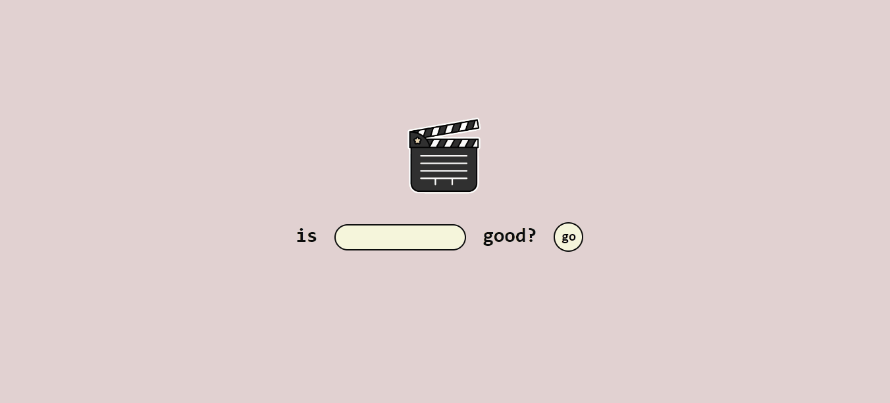

# Is it good?
Find out if a movie is good or not.'Is it good?' uses the [OMDb API](https://www.omdbapi.com/) to search for movie scores in Rotten Tomatoes, IMDB and Metacritic. Those scores are displayed along the following movie info: title, year, genre, rating, duration, director, actors and synopsis. There is also a 'OUR SCORE' field, which is the average of the three scores. 

## 🎬🎬🎬🎬 

## 
Firstly, go to the [OMDb API](https://www.omdbapi.com/) and get a API key. Insert this key in the get_data.js file. Then, type the name of the movie. Be precise. To return to the index, click on the animated clapperboard on the top right. 

## About 'Our Score'
Each score has a different format. RT is %, IMDb is a value between 1-10, and Metacritic is a value between 1-100. In order to calculate the 'Our Score', each one of these scores is converted into the 1-100 format. If one of the scores are not available, then the average is calculated based on the other scores left.
